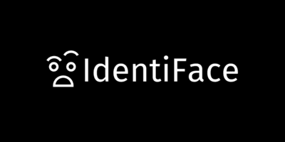
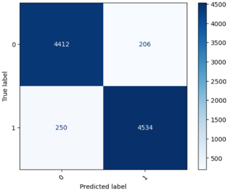
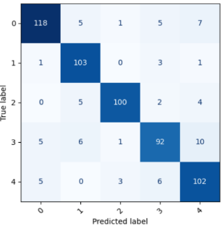
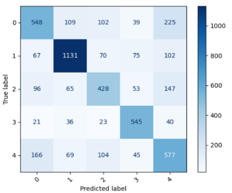
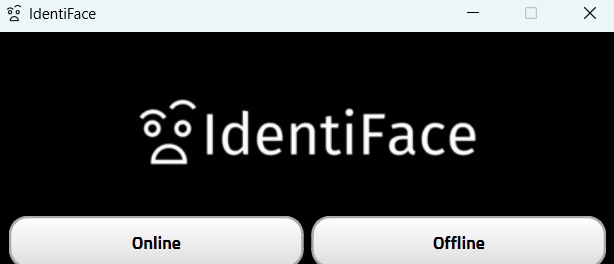
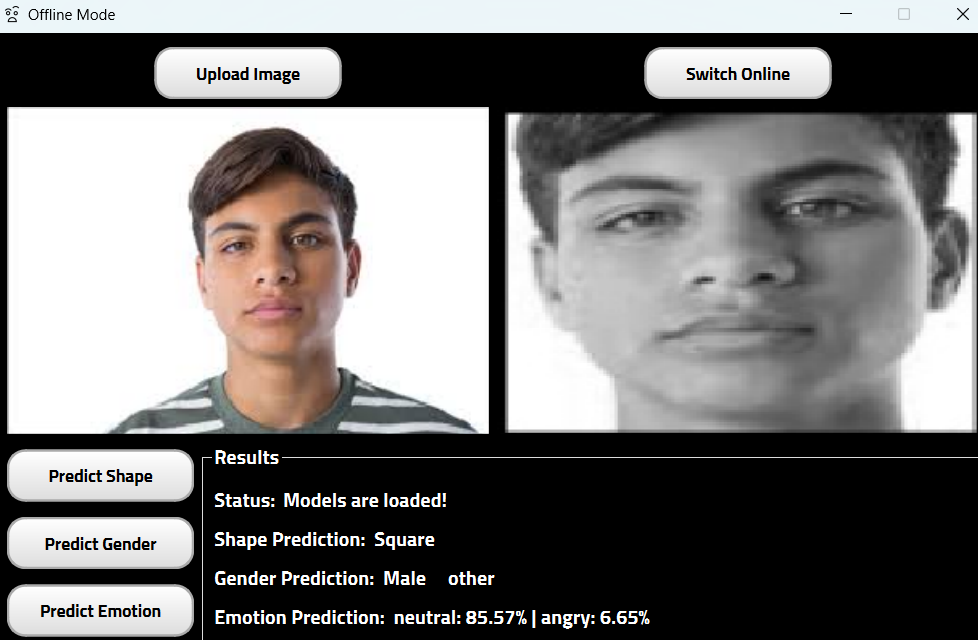
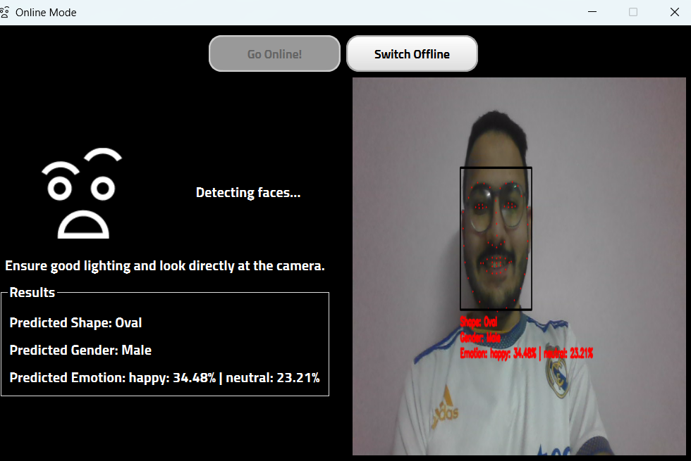

<div id = 'top'></div>

# IdentiFace 

*A Multimodal Facial Biometric System for Recognition, Gender Classification, Emotion Recognition and Face-Shape Prediciton*
<div align='center'>



</div>

____________________________________________________________________

## Contents:
* <a href="#ps">Project Structure and setup</a>
* <a href="#models">Models</a>
* <a href="#gui">GUI</a>
* <a href="#members">Team Members</a>
______________________________________________________________________

<div id="ps">

## Project structure


```
├── main.py [Main file: Contains the welcome window]
├── Backend
|    ├── functions.py [contains all the used functions]
|    ├── model_manager.py [manages the models across windows]
|    ├── offline.py [offline window layout]
|    ├── online.py [online window layout]
├── utilities [Face-Detection: the used Dlib files for facial detection]
├── assets [Directory for project assets]
├── Models [a drive link for all the used models]
├── snapshots [contains all the notebooks and the codes for the different modalities]
├── test_examples [Test images]
├── snapshots [Snaps taken from the app]
└── requirements.txt [List of all required Python modules]

```
#### Getting started :
1) Clone the repository
2) Install the required dependencies by running `pip install -r requirements.txt`

```
dlib==19.24.2
keras==3.0.2
matplotlib==3.8.2
numpy==1.26.2
PySide6==6.6.1
tensorflow==2.15.0.post1


```
3) run `main.py` to start the application

</div>

<div id="models">

## Models

*check the <a href="https://github.com/MahmoudRabea13/IdentiFace/blob/main/IdentiFace%20A%20VGG%20Based%20Multimodal%20Facial%20Biometric%20System%20.pdf">`Paper`</a> for more detailed information about the data used / preprocessing / methodology or any other aspect of the project*

## The final used models in the GUI were as follows: 

I. Face Recogniton Model trained on a subset of <a href="https://www.nist.gov/itl/products-and-services/color-feret-database">the color FERET database</a>  

II. Gender Classification Model trained on a <a href="https://www.kaggle.com/datasets/cashutosh/gen
der-classification-dataset/data"> Public Gender dataset </a>

III. Face-Shape Prediciton Model trained on <a href="https://www.researchgate.net/publication/328775300_A_Hybrid_Approach_to_Building_Face_Shape_Classifier_for_Hairstyle_Recommender_System">the Celebrity face-shape dataset</a> 

IV. Emotion Recognition Model trained on <a href="https://www.kaggle.com/datasets/msambare/fer2
013">the FER2013 dataset</a>

<div align="center">

|`Model`|`Train Accuracy`|`Test Accuracy`|`Confusion Matrix`|
|-------|----|-----|------|
|*Face Recognition*|99.7%|99.2%| |
|*Gender Classification*|96.48%|95.15%| |
|*Face-Shape Prediction*|99.79%|88.03%| |
|*Emotion Recognition*|81.26%|66.13%| |

</div>

</div>

<div id="gui">

## GUI

We developed a Pyside desktop application called `IdentiFace`

The app mainly consists of:

I. A welcome window

II. An offline window

III. An online window

*Note that because of the recognizer require high quality images , it was added only to the offline mode.*


|`window`|`screenshot`|
|---|---|
|*welcome window*||
|*offline window*||
|*offline window*||
|*online window*||


</div>
<div id="members">

## Team Members

* [Mahmoud Rabea](https://github.com/MahmoudRabea13)
* [Hanya Ahmad](https://github.com/Hanya-Ahmad) 
* [Nourhan Sayed](https://github.com/Nourhan-Sayed) 
* [Sohaila Mahmoud](https://github.com/sohailamahmoud) 

*Note that this project was part of the Biometrics in the Senior SBME year at Cairo University under the supervision of DR. Ahmed.M.Badawi and the guidance of TA Laila Abbas*


</div>


<p align="right"><a href="#top">Back to top</a></p>
